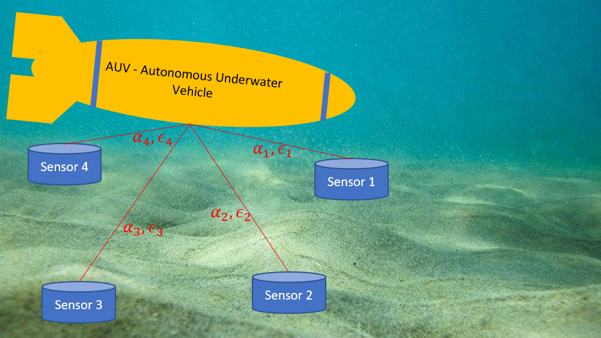
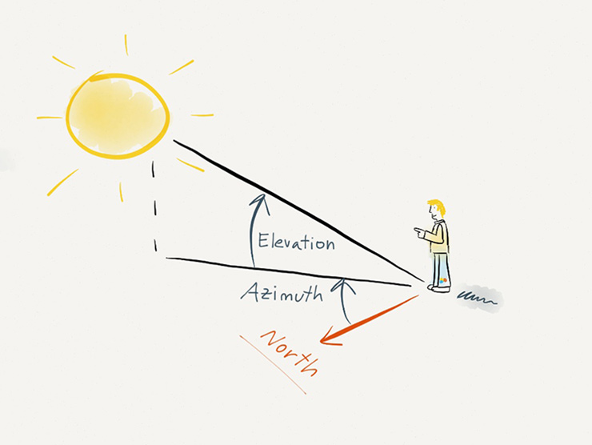

# Outline
Navigation of Underwater Autonomous Vehicle (AUV)
## Motivation
Challenge: GPS doesn't work underwater

Acoustic sensors are used underwater

The AUV is sent to a mission and needs to dock to charge / transfer data
![docking image [[1]](#1)](images/docking-station-for-AUV.jpg "")

Our focus: improving AUV localization
## Settings
Acoustic sensors are placed on the seabed and send info

## LOS

