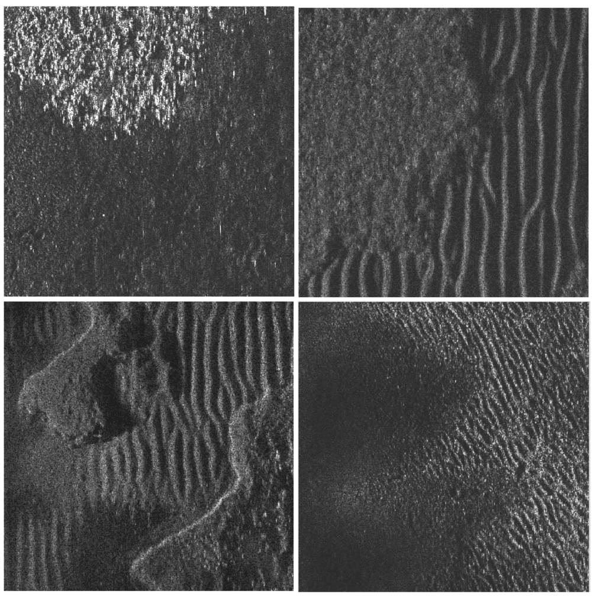

# Outline
Navigation of Underwater Autonomous Vehicle (AUV)
## Motivation
Challenge: GPS doesn't work underwater

Instead: acoustic data can be used underwater.
Acoustic imaging using Sonar

When does the AUV change it's coarse (angle)? for localization

## Seabed types
Task is not trivial. seabed is mixed, no clear boundaries

## Different angles
